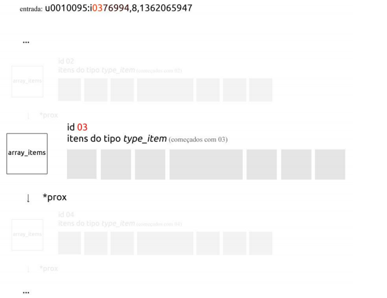

# recommendation-system-item-based


Collaborative Movie Recommendation (Item-Based). Developed in C Language.

## About
The goal of this project was to implement a recommendation algorithm for movies using a memory-based model. There are several implementation options that will impact the quality of the recommendations, including options for data normalization, similarity computation, neighborhood selection, aggregation, and dimensionality reduction.

## Development

**Language**

The project was developed using the C programming language.

**Item-Based**

To solve this project, we approached the recommendation through item-based collaborative filtering. The algorithm calculates the similarity between items in order to find similar items to predict user ratings.

**Pearson's Correlation**

To compute similarity, the Pearson correlation formula was implemented, where two vectors are passed and values between -1 and 1 are returned, where -1 represents that the two items are not similar at all and 1 represents maximum similarity between two items.


**Neighborhood of Similar Items**

After computing the similarities, the 2 closest items were considered for recommendations. The small size of the neighborhood was chosen to ensure that this calculation did not impact the algorithm's performance.

**Data Types**
The data read from the input files was organized as follows:

```
typedef struct type_item{
  charid[12];
  intusers_evaluation[MAXUSERS];
  intratings;
} type_item;
```

Data type that stores the important information of an item. Note that each item has a vector containing the ratings from all users. For users who did not rate the item, the value 0 is inserted in the position of the vector corresponding to that user.


Each user has an ID number (read from the input file); this number represents the position in the vector where the user’s rating will be placed. Users who did not rate will receive 0 in the corresponding position of the vector.

```
typedef struct similar_item{
  charid[12];
  floatcorrelation;
  intrating;
} similar_item;
```

This type of data stores information relevant to similar items.

```
typedefstructuser_items{
  charid[12];
  intsize;
  type_item*item[3000];
} user_items;
```

A data type was developed to optimize performance, storing all items that a user has evaluated, since it would not be necessary to go through the entire database to find out such information. Pointers to the items that the user has evaluated were used.

- Data structures

Since the algorithm was created using item-based collaborative filtering, items were treated as the main "entity", so that a quick and efficient search for an item became essential from a performance point of view. When an item is read from the input files, it needs to be quickly inserted into the data structure. If it is already there, a rating must be added to it.

How was this done? Well, as seen above, each item has a vector that represents the ratings of all users. When receiving a rating from a user, the rating is inserted into the vector in the corresponding position for that user. --
The items, in turn, were stored in a list of vectors (something similar to hash tables), where a certain type of indexing was done. Each item also has an ID number read from the input file. The first two digits of this number represent the position in the list where this item is located. Each position in this list stores a vector with all the items that also begin with the same digits.



```
struct array_items {
  type_itemitem[ITEMS];
  intid;
  intsize;
  structarray_items*prox;
} array_items;
typedef struct array_itemslist;
```

## Evolution, Complexity Analysis and Performance

The complexity of the algorithm was almost exponential m², where m represents the number of items, since for each item it was necessary to go through all the items to build the neighborhood of similar items. This was the part of the project that most affected the performance of the code, so a minimum similarity value was used, so that, given an item, as soon as the algorithm finds two items with similarity above the minimum value, it stops calculating the similarity. This value was 0.0 (remembering that the Pearson correlation scale goes from 1 to 1). This decision optimized the complexity and consequently the performance, since the code took around 15 to 10 minutes to execute, after this change, it went down to less than 5 minutes of execution.
